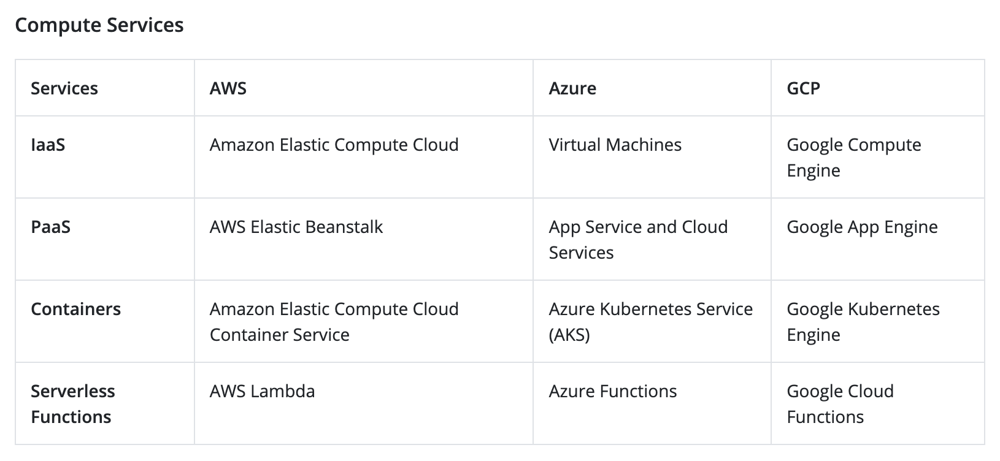

### CMIT 326 - Project 2

#### 26 Oct 2021

#### [`Harry Randazzo`](https://razzle.cloud)

<small>Press the play button below to start the audio.</small>

-----

Navigate using your arrow keys. If you see a &#8681; in the bottom right nav there is content below. Try it now!

---

## Nice!

To view all slides press the `ESC` key, otherwise press `>` to move to the next slide.

-----

## Summary

- Company Profile
- Current Struggles
- Current Infrastructure
- Top 3 Cloud Providers
- Final Recommendation
- Conclusion

-----

## Company Profile

_Don & Associates_: financial consulting company that provides services to small and medium-sized companies. 

- Operates physical infrastructure, networks, and servers.
- Looking to expand its services and locations.
- Worries about the __cost__ of such expansion.

-----

## Current Struggles

Future expansion will cause increased:

- Need for personnel, equipment, etc... (_cost_)
- Uptime requirements (_availability/reliability_)
- Maintenance complexity (_scalability_)
- Overall system complexity (_repeatability_)

-----

## Current Infrastructure

- Internal:
  - 2 servers (primary+backup) with Windows Server 2019 running Microsoft Active Directory for domain management / user access control.
  - 200 users.
  - 30 Cisco Catalyst 2960G switches (access).
  - 4 Cisco Catalyst 9300 switches (core).
- External:
  - 2 domains owned: `donandassociates.com` and `donandassociates.org`.
  - Domains leased via Google Domains, with Google also providing DNS.
  - 1 Cisco ASA (firewall)
  - 1 Cisco ISR 1100 (router)
- Contracts:
  - Salesforce (CRM)

-----

## Top 3 Cloud Providers

- Amazon (AWS)
- Microsoft (Azure)
- Google (GCP)

---

## Infographic comparison

---

## Infographic cont.

[photo cred](https://intellipaat.com/blog/aws-vs-azure-vs-google-cloud/)

---

## Amazon

- Largest market share / most mature.
- _“Currently, serves 245 countries and spans 25 geographic regions”_.
- _“Fees are based on a pay-as-you-go model, depending on the hardware and software or
networking options chosen.”_
- __Prices have not gone down since 2014.__
- Services do not interact well with non AWS
services.
- Can become locked into the AWS ecosystem.

---

## Microsoft

- Similar pricing / pay model to AWS.
  - Slightly more affordable.
- Much clearer naming conventions for services.
  - Ex. `Elastic Compute Cloud` vs `Virtual Machines`
- Great interoperabilty w/ onprem Microsoft products.
  - ex. Azure Active Directory, Azure SQL...
- __Advantage: made by Microsoft, Disadvantage: made by Microsoft__

---

## Google

- Pay per _second_ vs pay per _minute_.
- Better _“machine learning and data science capabilities with it’s products like TensorFlow, ML Kit and Google Datasets.”_
- No vendor lock-in.
- Not as mature / full featured.

-----

## Final Recommendation

> AWS

- Mature
- Reliable
- Scalable
- _Caveats:_
  - Build services to not rely upon AWS specific features
  - Utilize open-source
  - Fully evaluate pricing model(s) for our exact use case

-----

## Conclusion

- Company Profile
- Current Struggles
- Current Infrastructure
- Top 3 Cloud Providers
- Final Recommendation

-----

# Thanks!

-----

## made with

#### [reveal.js](https://github.com/hakimel/reveal.js)

#### [reveal.js template](https://github.com/pacharanero/create-new-revealjs-template)

#### [Google Fonts](https://fonts.google.com/)

#### [favicon.io](https://favicon.io/)

plus some customizations by yours truly

-----

## Works Cited

- \[1\] https://k21academy.com/amazon-web-services/aws-solutions-architect/aws-vs-azure-vs-gcp/
- \[2\] https://www.avenga.com/magazine/top-cloud-service-providers/
- \[3\] https://cloud.google.com/free/docs/aws-azure-gcp-service-comparison

[Repo URL](https://github.com/Noxsios/compare-cloud-vendors)